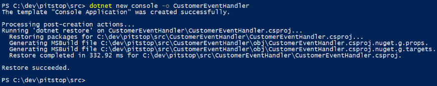
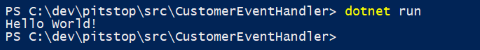
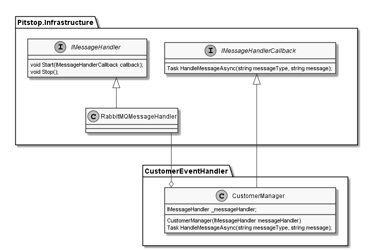
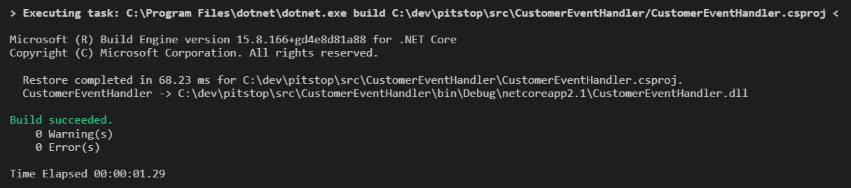
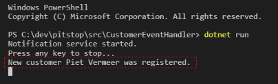
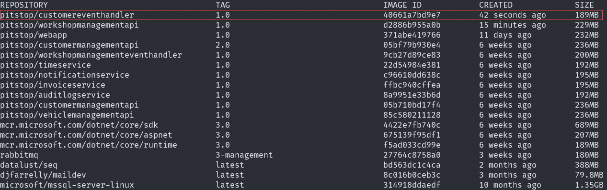
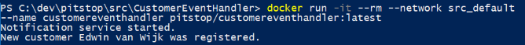
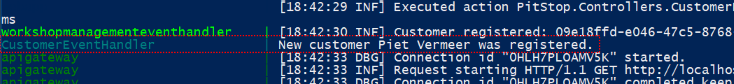
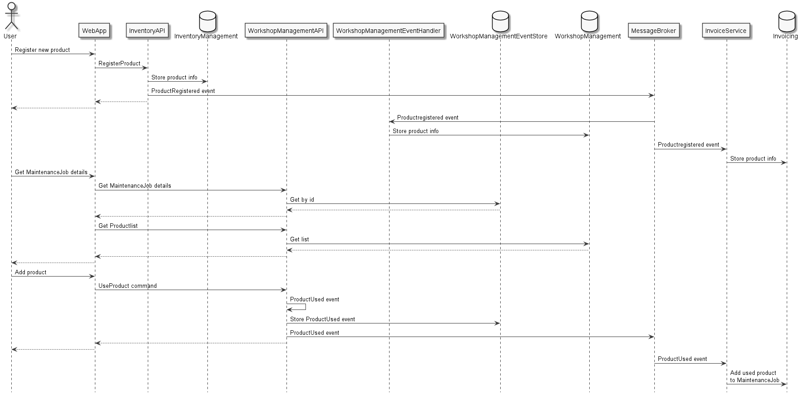

# Cloud-native Architecture workshop
In most workshops you start from scratch, but in this workshop you will actually start with a complete working solution called Pitstop. You will learn by executing several labs in which you will be adding functionality to the solution.

Pitstop is an open-source .NET Core sample application that demonstrates the following software-architecture aspects:

- Microservices
- Event-driven architecture
- Domain Driven Design
- Onion architecture
- CQRS
- Event-sourcing

Also, Pitstop demonstrates how to develop and deploy applications using Docker containers.

# Labs
In order to complete the labs, make sure you read (at least) the following sections of the [Pitstop wiki on Github](https://github.com/EdwinVW/pitstop/wiki):

- [Start page](https://github.com/EdwinVW/pitstop/wiki/Home)
- [Application functionality](https://github.com/EdwinVW/pitstop/wiki/Application%20functionality)
- [Domain description](https://github.com/EdwinVW/pitstop/wiki/Domain%20description)
- [Solution architecture](https://github.com/EdwinVW/pitstop/wiki/Solution%20Architecture)
- [Technology used](https://github.com/EdwinVW/pitstop/wiki/Technology%20used)

By now, you should have an understanding of what the Pitstop solution contains and what functionality it offers. Next you will execute several lab assignments in which you will add stuff to the Pitstop solution.

## Lab 0: Preparation
There are some prerequisites for this workshop. First you need an active Internet connection. Additionally you will need to install the following software on your laptop:

- Docker Community Edition (CE)
- Visual Studio Code
- .NET Core SDK
- (optional) Git client
- (optional) Azure Data Studio

>If you already have satisfied these prerequisites, you can skip Lab 0 and go directly to Lab 1. 

### Step 0.1: Install prerequisites
Install the following software (if not already installed) on your laptop: 

#### Docker CE
Download link: <a href="https://docs.docker.com/install" target="_blank">Docker Community Edition (CE)</a>. 

On Windows, you need Hyper-V to be enabled on your machine in order to install Docker for Windows CE. If you have not enabled Hyper-V, do so now. <a href="https://docs.microsoft.com/en-us/virtualization/hyper-v-on-windows/quick-start/enable-hyper-v" target="_blank">Here</a> you find a description of how to enable Hyper-V on Windows. Make sure to double-check the prerequisites.

For downloading Docker CE, you need to login with your Docker Id. Create one if you don't already have a Docker Id. 

During the installation of Docker CE, do not switch to Windows containers. We will only use Linux containers. After the installation you need to log out and login again (sometimes reboot your machine).

After the installation, start the Docker engine by double clicking the Docker for Windows icon. 

#### Visual Studio Code
This workshop assumes you are working with Visual Studio Code.  
Download link: <a href="https://visualstudio.microsoft.com/downloads" target="_blank">Visual Studio Code</a>

#### .NET Core SDK
Install the .NET Core SDK version 3.1.  
Download link: <a href="https://www.microsoft.com/net/download" target="_blank">.NET Core SDK</a>

#### Git client
Install the Git client for your OS to interact with the Pitstop repo on Github.  
Download link: <a href="https://git-scm.com/downloads" target="_blank">Git</a> 

#### (Optional) Azure Data Studio
Install the Azure Data Studio so you can inspect the SQL Server databases used by Pitstop. Use the *User Installer* when working on Windows. 
Download link: <a href="https://docs.microsoft.com/en-us/sql/azure-data-studio/download-azure-data-studio" target="_blank">Azure Data Studio</a> 

### Step 0.2: Get access to Github
If you do not already have a Github account, create one by going to the <a href="https://www.github.com" target="_blank">Github website</a> and click on the *Sign up* link in the top right corner. Make sure you are logged into Github with your account. 

## Lab 1: Run the applicaton
In this lab we'll make sure you can run Pitstop on your machine. 

### Step 1.1: Get the sources
Get the sources from Github onto your machine.

For this to work, you must have installed the Git client (see Step 0.1). 
1. Open your browser and navigate to the Pitstop repo on Github: <a href="https://github.com/edwinvw/pitstop" target="_blank">https://github.com/edwinvw/pitstop</a>. 
2. Click the *Fork* button.
3. The repo is forked to your Github account. If you have multiple accounts, Github will ask which account to fork to.
4. Click the green *Clone or download* button on the forked repo. A dialog is shown.
5. Copy the repo URL to the clipboard. 
6. Open Visual Studio Code on your machine.
7. Give the clone repo command by pressing `CTRL-Shift-P`, typing `Git Clone` and pressing `enter` to confirm. You will be asked to specify a repo URL.
8. Paste the copied repo URL in the text-box and press `enter` to confirm.
9. You will be asked to specify a folder for cloning the repo into. Select a folder and confirm. The repo will be cloned in this folder.
10. When VS Code asks you to open the cloned repo, do that. Now you can start working with the repo.

This would be a good time to walk through the solution and see what's in there. In the <a href="https://github.com/EdwinVW/pitstop/wiki" target="_blank">Wiki</a> of the repo, you can find an overview of the solution structure. 

### Step 1.2: Build the Docker images
In order to build the Docker images, follow the instructions in the <a href="https://github.com/EdwinVW/pitstop/wiki/Building%20the%20Docker%20images" target="_blank">'Building the Docker images' section</a> in the repo's Wiki.

### Step 1.3: Run the application
In order to run the application, follow the instructions in the <a href="https://github.com/EdwinVW/pitstop/wiki/Run%20the%20application%20using%20Docker%20Compose" target="_blank">'Starting the application' section</a> in the repo's Wiki.

### Step 1.4: Get to know the solution
In order to get to know the functionality of the application, make sure you have read the introduction of the solution in the repo's README file up to the *Technology* section. After that, follow the <a href="https://github.com/EdwinVW/pitstop/wiki/Testing%20the%20application" target="_blank">'Testing the application' section</a> in the repo's Wiki. 

## Lab 2: Add an event-handler for customer events
When something happens within the Pitstop application that could be interesting for other parts of the system, an event is published to the message-broker. For instance: when a new customer is registered, a *CustomerRegistered* event is published. 

In this lab you will add a service to the solution that will react to customer events. What we will do when the event is received is up to your imagination. For the workshop, we will keep it simple and just dump a message on the console. 

The service we will build offers no API and can therefore be a simple console application (just as the existing *NotificationService* for instance). 

### Step 2.1: Create the .NET Core application
First we will add a new service to the solution. 

1. Open a command-prompt or Powershell window.
2. Make sure you are in the `src` folder within the Pitstop repository.
3. Use the `dotnet new` command to create a new .NET Core console application named *CustomerEventHandler*:
   ```
   dotnet new console -o CustomerEventHandler
   ```
   The output should look something like this:

   

A new *CustomerEventHandler* folder will be created which contains a .NET Core project. Because the created project-type is a console application, the folder will only contain a project file (*CustomerEventHandler.csproj*) and a main program file (*Program.cs*). The default implementation generated by `dotnet new` is printing *'Hello World!'* to the console.

You can test the application by running it:

```
cd CustomerEventHandler
dotnet run
```

The output should look like this:



### Step 2.2: Create event-handler
Now that you've added a new .NET Core project to the solution, you can start implementing the business logic of the service. As stated, the 'business logic' will be fairly simple for this workshop.

**2.2.1: Open the project in VS Code**  
Let's open Visual Studio Code to start coding:

1. Start Visual Studio Code.
2. Select *File*, *Open Folder* and select the *CustomerEventHandler* folder you created in step 3.1. 
   >Visual Studio Code might show you some dialogs about plugins that you can install. For now, just install all plugins that it suggests. It will also asks you to add some 'assets' it needs for building and debugging the project. Acknowledge this with 'Yes'. This will create a '.vscode' folder. You can ignore that folder for now.
   
3. Open the file *CustomerEventHandler.csproj* by double-clicking on it. This is the file that describes the project. It is pretty straightforward and clean.
4. Start the application by pressing `F5`. The project will be built and started. You can see the output in the 'DEBUG CONSOLE' window that was automatically opened.

**2.2.2: Add reference to the infrastructure package**  
The CustomerEventHandler service will need to receive messages from the message-broker. I have created a nuget package (*Pitstop.Infrastructure*) that contains a library that will make it easy to implement this without any specific knowledge about RabbitMQ (the broker that is used in the solution). 

You need to add a reference to the *Pitstop.Infrastructure.Messaging* nuget package. Execute the following steps to add a reference to the package: 

1. Open the terminal window in Visual Studio Code using the *Terminal* menu.
2. Type the following command in this window: `dotnet add package PitStop.Infrastructure.Messaging`. 
3. Visual Studio Code will detect changes in the references and automatically restore the references.

**2.2.3: Add event definition**  
Now you can start adding some business logic. First you need to add the definition of the events you want to handle. All messages that are sent over the message-broker are plain JSON. The *CustomerRegistered* event is defined as follows:

```JSON
{
	"messageId": "guid",
	"messageType": "string",
	"customerId" : "string",
	"name": "string",
	"address": "string",
	"postalCode": "string",
	"city": "string",
	"telephoneNumber": "string",
	"emailAddress": "string"
}
```

You need to define a C# class to hold this information. We will only use the *customer id* and *name* properties in our code, so in your event-definition you can skip the other customer properties.

The infrastructure package you referenced in the previous step contains an *Event* base-class for events. This class inherits from the *Message* base-class which contains the *MessageId* and *MessageType* properties (the message-type is inferred from the name of the class).

1. Add a new *CustomerRegistered* class to your project.
2. Derive this class from the Event base-class in the *Pitstop.Infrastructure.Messaging* library.
2. Add the implementation of the event-class that only contains the *customerId* and *name* property of the customer.

**2.2.4: Add a *CustomerManager* class that handles events**  
Now that you have a definition of the event, you will add a *CustomerManager* class that will get the events from the message-broker and handles them. The polling for messages and the handling of a message when it's available are abstracted in two separate interfaces: *IMessageHandler* and *IMessageHandlerCallback*. They are both defined in the infrastructure package.  

The *IMessageHandler* interface abstracts the polling for messages on a message-broker. An implementation of this interface will be passed into your *CustomerManager*'s constructor. The infrastructure package also contains an implementation of this interface that works with RabbitMQ. 

When you want to start listening for messages, you have to call the *Start()* method on this interface and pass in an implementation of the *IMessageHandlerCallback* interface. The *HandleMessageAsync()* method is called on the callback implementation when a message is available on the message-broker. The *CustomerManager* will implement this interface and handle the events.

This is a class diagram of this pattern:

 
1. Add a new *CustomerManager* class to your project.
2. Add the implementation that handles *CustomerRegistered* messages. You can reference other event-handlers (e.g. *AuditlogService*) for inspiration.

**2.2.5: Start the customermanager**  
Now that you created a *CustomerManager* that can handle *CustomerRegistered* events, you need to start this manager form the main program. You will use the *RabbitMQMessageHandler* class from the infrastructure package to pass into the *CustomerManager*. 

1. Open the *Program.cs* file in the project.
2. Replace the existing code with the necessary code to setup and start the event-handler. You can reference other event-handlers (e.g. *AuditlogService*) for inspiration.

**2.2.6: Build the code**  
In order to check whether or not you made any mistakes until now, build the code. Do this by pressing `Ctrl-Shift-B` in Visual Studio Code and choosing the task *Build*. The output window should look like this:

 

### Step 2.3: Run the service
We can start the *CustomerEventHandler* to test whether or not it works. 

1. Make sure you have the Pitstop application running on your machine (as described in Step 1.3: Run the application).
2. Open a command prompt or Powershell window and go to the *CustomerEventHandler* folder.
3. Start the application by giving the following command: `dotnet run`.
4. Open the browser and go to http://localhost:7000 to open the Pitstop web-app.
5. Go to the *Customer Management* tab and register a new customer.

Watch the output window of your *CustomerEventHandler*. You should see that a message is printed to the console, something like this:

 

That's it! You have now created a new service that can react on events emitted by the services in the Pitstop solution. Pretty sweet!

### Step 2.4: Create Docker image
Now that you have created a functional service, let's run it in a Docker container.

1. Add a new file to the project named *Dockerfile*.
2. Copy the contents of the dockerfile of the *AuditlogService* and make sure it starts the CustomerEventHandler (in the ENTRYPOINT statement).

> Please take some time to go over the Dockerfile now. You see an example of the Docker multi-stage build mechanism. 
> - First it starts in a container that is based on an image that contains the full .NET Core SDK (*mcr.microsoft.com/dotnet/core/sdk:3.1*). We call this *build-env* for later reference.
> - After that it sets the folder */app* as the current working-folder for the build. It copies the *.csproj* file of your project into to the working-folder. 
> - Then it restores all the dependencies by running `dotnet restore`. 
> - After the restore, it copies the rest of the files to the working-folder and publishes the application by running `dotnet publish -c Release -o out`. It builds the *Release* configuration and outputs the result in the folder *out* within the working-folder.
> - Now it starts the second phase which runs in a container based on the .NET Core run-time container (*mcr.microsoft.com/dotnet/core/runtime:3.1*). This container does not contain the entire .NET Core SDK - so it's much smaller.
> - It then copies the output from the other build phase (that was called *build-env*) to the local folder within the container.
> - Finally it specifies the entry-point - the command to execute when the container starts. In this case it specifies the command `dotnet` and as argument the assembly that was created during the build. This will start the *CustomerEventHandler* console application you've created.

Now you are going to build a Docker image using the Dockerfile.

1. Open a command prompt or Powershell window and go to the *CustomerEventHandler* folder.
2. Build a Docker image by entering the following command: 

	`docker build --rm -t pitstop/customereventhandler:1.0 .`

   > You specify the name of the image using the *Tag* option (`-t`).
3. Check whether the image is created by entering the following command: `docker images`:

   

### Step 2.5: Run the service in a Docker container
Now that you have the Docker image, you can start a container based on this image. 

1. Run a Docker container based on the image by entering the following command:

	`docker run -it --rm --network src_default --name customereventhandler pitstop/customereventhandler:1.0`

   >In this command you specify the virtual network to connect with. In this case we specify the name of the default network that was created by docker-compose when we started the solution (*src_default*). By doing this, the container can find and access the RabbitMQ server that is running in a separate Docker container on the virtual network.
2. Open the browser and go to http://localhost:7000 to open the Pitstop web-app.
3. Go to the *Customer Management* tab and register a new customer.

Watch the output of your running container. You should see that message again that indicates that a customer was registered:



**Before you continue, stop the running container by pressing `Ctrl-C`.**

### Step 2.6: Run the service using docker-compose
The last step in this lab is to extend the docker-compose file to include your service. 

1. Open the *docker-compose.yml* file in the *src* folder of the Pitstop repo in Visual Studio Code.
2. Add this snippet to the *docker-compose* file just before the webapp part:
 
   ```
     customereventhandler:
       image: pitstop/customereventhandler:1.0
       build: CustomerEventHandler
       container_name: CustomerEventHandler
       depends_on:
         - rabbitmq
       environment:
         - DOTNET_ENVIRONMENT=Production    
   ```
3. Save the file.
4. Open the Powershell window where you started the solution using `docker-compose up`.
5. Stop the running solution by pressing `Ctrl-C` and wait until all the containers are stopped.
6. Restart the solution by giving the command: `docker-compose up`. The *CustomerEventHandler* will be started together with all the other services.
2. Open the browser and go to http://localhost:7000 to open the Pitstop web-app.
3. Go to the *Customer Management* tab and register a new customer.

Watch the docker-compose logging in the console. You should see that message again that indicates that a customer was registered:



>The following labs are more advanced labs you can do on your own if you're done with the first two labs. There's no extensive description on how to complete these labs, only a description of the required outcome. It's up to you to figure out the best way to implement these requirements. 

## Lab 3 - Add Inventory management
During a maintenance job, a mechanic often uses products like: tires, windscreen-wipers, oil, oil-filters, etcetera. There is currently no way to support this in Pitstop. In this lab you have to add the ability for a mechanic to add products that he or she uses during the execution of a maintenance-job. For every product used, the inventory must be updated and the price of the products must be added to the bill that is sent to the customer. 

> Caution: this is a pretty big lab and it contains less detailed instructions than Lab 2. So take your time for this one!

In the context-map shown in the <a href="https://github.com/EdwinVW/pitstop/wiki/Domain%20description" target="_blank">domain description</a> on the Wiki, Inventory Management is shown (grayed out). Use this information in this assignment. 

These are the requirements for this lab:
- The user must be able to add new products (update / delete not necessary).
- When adding a product, the user must be able to specify a name and a price of a product. A product id should be generated automatically.
- When a new product is added, a *ProductRegistered* event must be emitted to the message-broker.
- The *ProductRegistered* event must be ingested by the *WorkshopManagementEventHandler*. Registered products must be stored in the WorkshopManagement reference-data database. 
- According to the sequence diagram. ProductRegistered is also ingested by the Inventory Service.
- A mechanic must be able to select a product (dropdown) and amount (text-box) for a particular *MaintenanceJob* (on the details page).
- When the selection is saved, a *UseProduct* command must be created that must be handled by the *WorkshopManagement* domain.
- Handling of the *UseProduct* command must produce a *ProductUsed* event that must be added to the *WorkshopManagement* event-store. This is the structure of the event:
 ```JSON
   {
      "messageId": "C0EAA76D-D566-41F8-B747-3D15C1F58996",
      "messageType": "ProductUsed",
      "maintenanceJobId": "0EC3A1DA-BDB9-4090-A76A-217D4474A4EA",
      "productId" : "C21042C8-D87A-4640-AE27-6C83F100347A",
      "amount": 2
   }
 ```
- The *ProductUsed* event must be published to the message-broker.
- The *ProductUsed* event must be handled by the *Invoicing* domain. This must add the used product to the maintenance-job.
- The *Invoicing* domain must add the products and price to the invoice when created.

> We will ignore updating the stock-amount of a product in this lab. For simplicity, we just assume there's an unlimited supply of products available in the inventory. Maybe you can implement a stock-amount in the *Inventory* domain (and updating this using *ProductUsed* events) as a bonus exercise. 

This is a sequence diagram explaining the interaction between the different components involved:



To fulfill these requirements, execute the following steps:

### Step 3.1: Create the *InventoryManagementAPI*

> For this step you can look at the existing *CustomerManagementAPI* for inspiration.

1. Add an *InventoryManagementAPI* project (ASP.NET WebAPI) to the solution that can be used to manage products.
2. Implement a POST operation on the API controller for registering a new product.
3. Implement data-access so the service can store products in a separate SQL Server database named *InventoryManagement*.
4. Expand the API controller so it uses a *RabbitMQMessagePublisher* (injected using standard DI) for publishing a *ProductRegistered* event. This is an example of the event:
   ```JSON
   {
      "messageId": "2DEF89EF-4403-4451-8661-A869258B301B",
      "messageType": "ProductRegistered",
      "productId" : "C21042C8-D87A-4640-AE27-6C83F100347A",
      "name": "All weather tire",
      "price": 85.0
   }
   ```
5. Test the functionality of registering a new product. Call the API directly and check whether the product is stored in the database and a *ProductRegistered* command is published to the message-broker.

### Step 3.2: Create the *InventoryManagement* UI module

> For this step you can look at the existing *CustomerManagement* module in the *WebApp*.

1. Add a simple screen in the *WebApp* that can be used to add products (hint: copy paste from existing pages in CustomerManagement module for example).
2. Create an HTTP client for calling the *InventoryManagementAPI*, inject it into to controller (using standard DI) and call it to register a product.
3. Test the functionality of registering a new product. Call the API directly and check whether the product is stored in the database and a *ProductRegistered* event is published to the message-broker.

### Step 3.3: Handle product-registration support to the *WorkshopManagement* domain

1. Expand the *WorkshopManagementEventHandler* so it ingests *ProductRegistered* events.
2. Add an event-handler that will store the registered product's information in the reference-data database (see the *CustomerRegistered* handler for inspiration).

### Step 3.4: Add product-selection to *WorkshopManagement* domain

1. Expand the *RefDataController* in the *WorkshopManagementAPI* so it can deliver a list of available products.
2. Expand the *MaintenanceJobDetails* page in the *WorkshopManagement* module in the *WebApp*:
   - Allow the user to select a product and an amount.
   - Allow the user to save the changes (or cancel without saving the changes).
   - Send a *UseProduct* command to the *WorkshopManagementAPI*. This is an example of the command:
   ```JSON
   {
      "messageId": "14F2E22C-FFC8-4079-A711-2DA52B755800",
      "messageType": "UseProduct",
      "maintenanceJobId": "0EC3A1DA-BDB9-4090-A76A-217D4474A4EA",
      "productId" : "C21042C8-D87A-4640-AE27-6C83F100347A",
      "price": 85.0,      
      "amount": 2
   }
   ```
3. Add a controller method and a *UseProductCommandHandler* to the *WorkshopManagementAPI* that will handle the *UseProductCommand* (look at the existing controller methods and command-handlers for inspiration).
   - Make sure the new command-handler is registered in the *CommandHandlersDIRegistration* class!
4. Expand the *WorkshopPlanning* and *MaintenanceJob* entities in the *WorkshopManagement* domain so they can handle the *UseProduct* command. This command should result in a *ProductUsed* event (that will be automatically stored in the event-store). This is an example of the event:
   ```JSON
   {
      "messageId": "C0CB1C09-2E5C-4E13-A600-DB8CFA53B5CD",
      "messageType": "ProductUsed",
      "maintenanceJobId": "0EC3A1DA-BDB9-4090-A76A-217D4474A4EA",
      "productId" : "C21042C8-D87A-4640-AE27-6C83F100347A",
      "price": 85.0,
      "amount": 2
   }
   ```
5. Expand the *WorkshopManagementAPI* so that products used for a *MaintenanceJob* are returned when retrieving the details of this *MaintenanceJob*.
6. Expand the *MaintenanceJobDetails* page in the *WorkshopManagement* module in the *WebApp* so that the products that were used for a *MaintenanceJob* are shown.
7. Expand the *UseProductCommandHandler* so it uses the message-publisher (injected using standard DI) to publish a *ProductUsed* event to the message-broker.
8. Test the functionality to see whether or not it works correctly.

### Step 3.5: Handle product-registration and -usage in the *Invoicing* domain

1. Expand the *InvoiceService* so it ingests *ProductRegistered* and *ProductUsed* events.
2. Add a *ProductRegistered* event-handler that will store the registered product's information (only productId and name) in the database.
3. Add a *ProductUsed* event-handler that will store the used product's information (productId, amount and price) with the *MaintenanceJob* specified in the event in the database.
4. Expand the generation of the invoice so that:
   - The name, amount and total price of the used products are shown on the generated invoice (1 line per used product).
   - The price of the used products is added to the total price.
5. Because you created the event handlers for *ProductRegistered* and *ProductUsed* in the *InvoiceService* last, you will probably have a mismatch between the list of products in the *InventoryManagement* database and the *Invoicing* database. Fix this mismatch. There are two appproaches (choose one):
   - Empty all the databases and start over with registering new products. This is fine for the workshop (and the quickest solution), but never a good solution in production! 
   - Replay all the *ProductRegistered* and *ProductUsed* events that were sent before by publishing them to the *Invoicing* queue using the RabbitMQ management console. See the <a href="https://github.com/edwinvw/pitstop/wiki/Testing%20the%20application#testing-notifications" target="_blank">'Testing the application' section</a> in the repo's Wiki for instructions on how to do this. You can use the JSON examples of the events in this lab as templates for the message-body. CAUTION: In the referenced description, a message is published to the *Pitstop* exchange. For your scenario, make sure you publish the events directly to the *Invoicing* queue. Try to answer for yourself why this is important.
6. Test the functionality to see whether or not it works correctly.

### Step 3.6: Run InventoryManagementAPI in docker container

As a bonus step, I will leave it entirely up to you to run the *InventoryManagementAPI* in a docker container as part of a docker-compose setup (see [Lab 2, step 2.4 - 2.6](#step-24-create-docker-image) for instructions). Use `pitstop/inventorymanagementapi:1.0` as tag for the container image.

